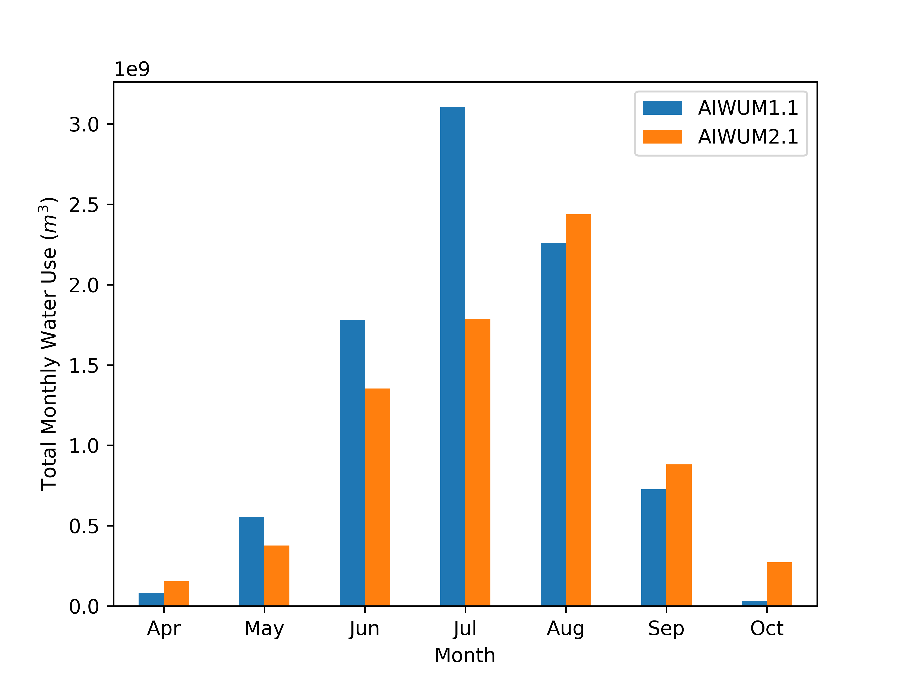
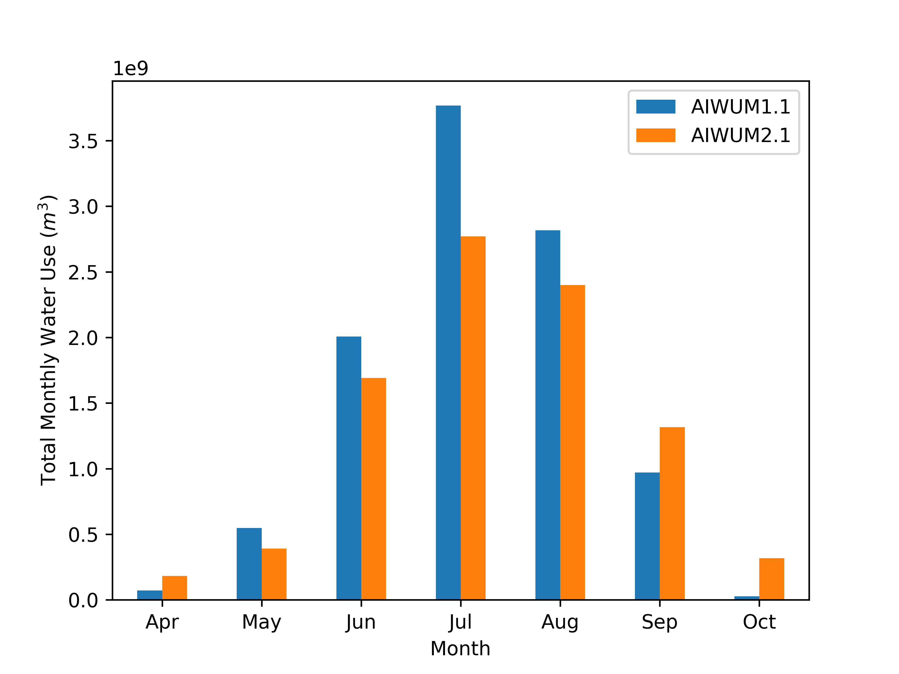
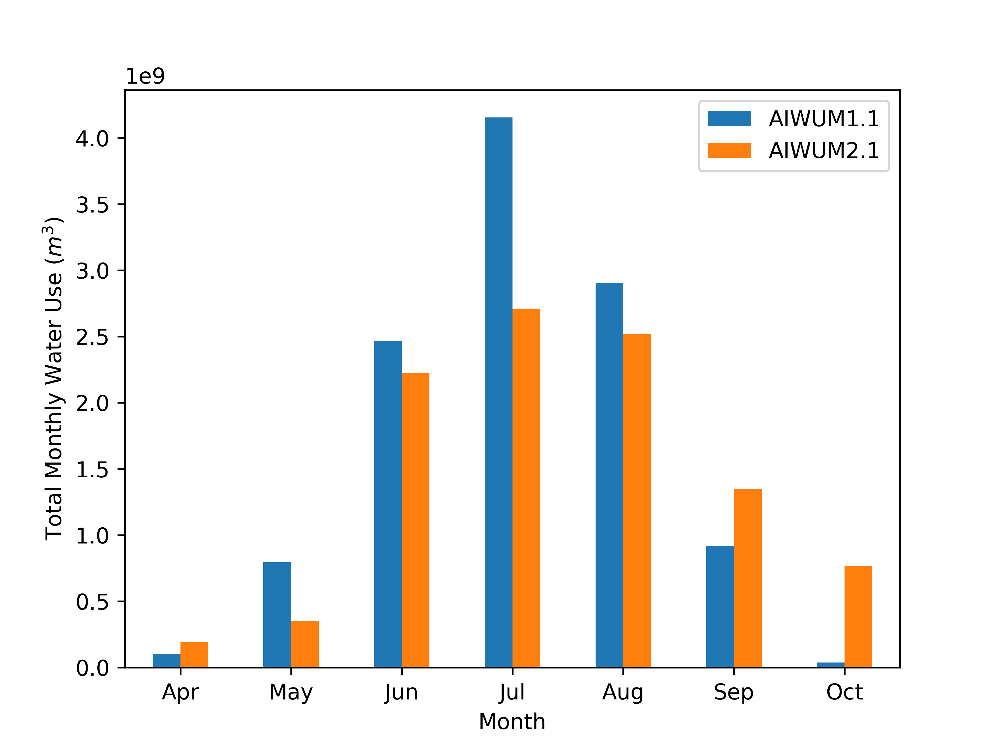
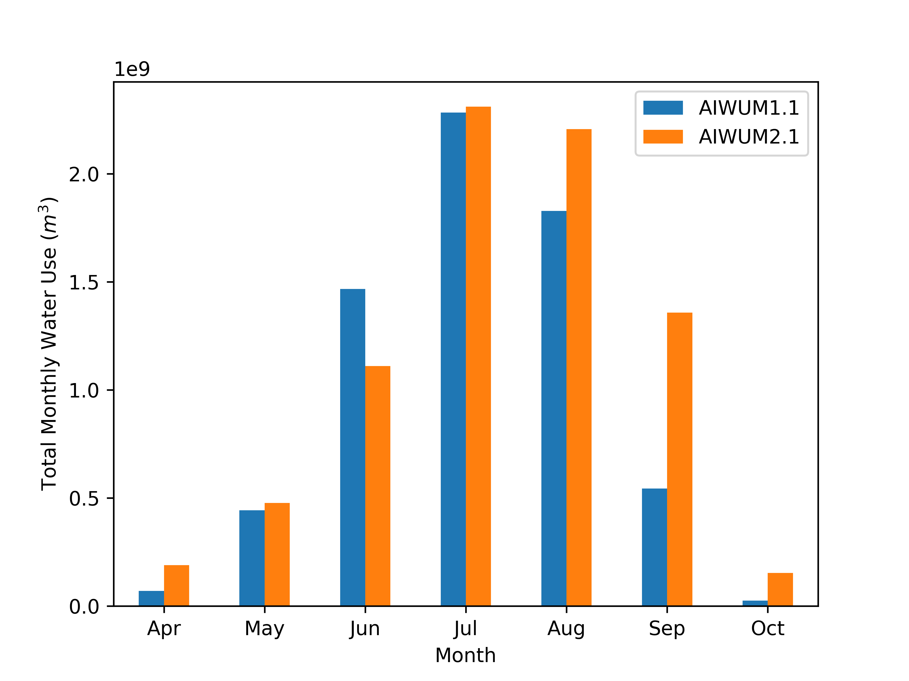
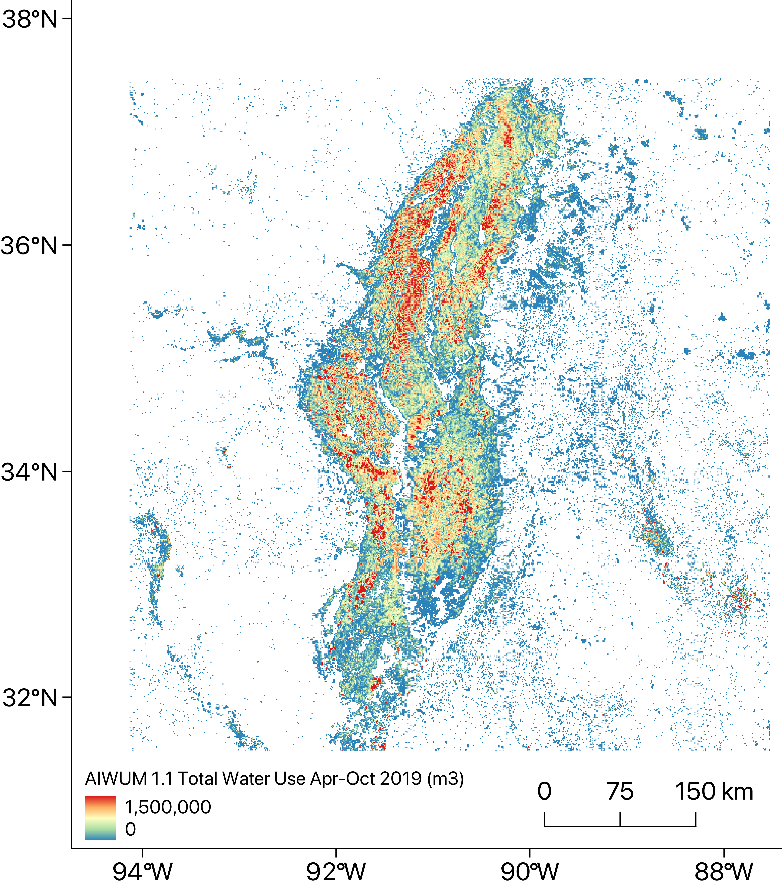
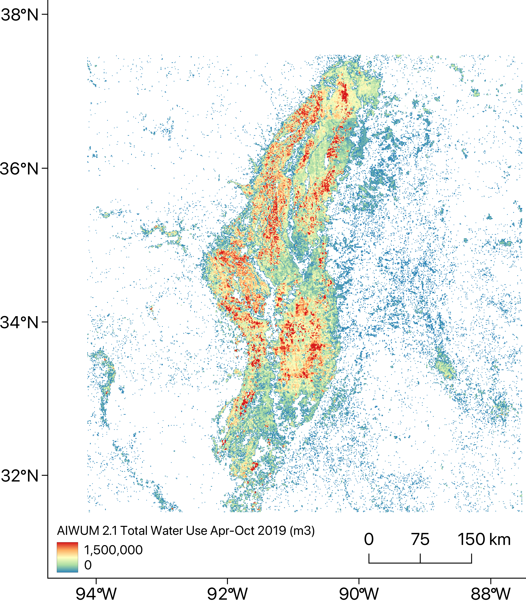
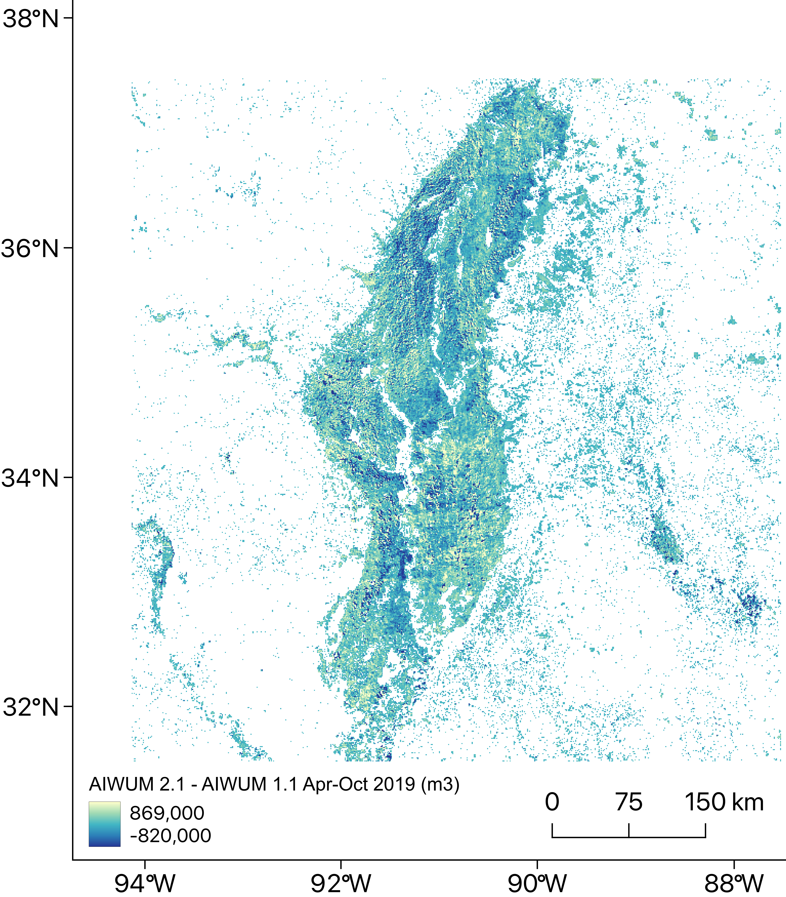

# AIWUM 2.1
Machine Learning codes for the USGS MAP project.

Authors: [Sayantan Majumdar](https://scholar.google.com/citations?user=iYlO-VcAAAAJ&hl=en) [sayantan.majumdar@dri.edu], [Ryan Smith](https://scholar.google.com/citations?user=nzSrr8oAAAAJ&hl=en) [ryan.g.smith@colostate.edu], and [Vincent E. White](https://www.usgs.gov/staff-profiles/vincent-e-white) [vwhite@usgs.gov]

 &nbsp;  

## Citations
**Software**: Majumdar, S., Smith, R., and White, V.E., 2023, Aquaculture and Irrigation Water Use Model 2.0 Repository: U.S. Geological Survey data release, https://doi.org…

**Data Release**: Majumdar, S., Smith, R.G., Hasan, M.F., Wilson, J.L., Bristow, E.L., Rigby, J.R., Kress, W.H., Painter, J.A., and White, V.E., 2023, Aquaculture and Irrigation Water Use Model (AIWUM) 2.0 input and output datasets, https://doi.org/10.5066/P9CET25K.

## Summary

The motivation for this project was to improve estimates of groundwater usage across the Mississippi Embayment (MISE), a large area within the Mississippi Alluvial Plain (MAP) region in support of an ongoing USGS effort to model the groundwater resources of the region. Agricultural use is the dominant water use in this region, and very few wells are monitored. The Mississippi Delta region has the most monitoring wells, with flowmeters on roughly 10% of the total irrigation wells. [Wilson (2021)](https://doi.org/10.3133/sir20215011) developed a lookup table based on these data that estimates water use based on average water use for each crop type, for specific regions, and precipitation amounts. The latest iteration of the [Wilson (2021)](https://doi.org/10.3133/sir20215011) model is referred to as AIWUM 2.0 (annual model). The method developed here is referred to as AIWUM 2.1. 

The goal of this project was to improve on that method by using additional data that is likely related to water use, such as remotely-sensed evapotranspiration, model-based estimates of soil moisture, and temperature. These and other variables are likely related to water use, but quantifying this relationship, which is often complex and non-linear, with traditional models is a challenge. Machine learning provides robust tools for ingesting large numbers of predictor variables and quantifying how they are related to a prediction of interest ([Hastie et al., 2001](https://hastie.su.domains/ElemStatLearn/printings/ESLII_print12_toc.pdf)). Previous works in Kansas and Arizona have demonstrated the ability to relate remote sensing and other gridded predictors to groundwater pumping data with good accuracy  (Majumdar et al., [2020](https://doi.org/10.1029/2020WR028059), [2022](https://doi.org/10.1002/hyp.14757)). In this study, we implement a similar approach to estimate monthly groundwater pumping throughout the MISE, at a monthly time-step, using data from existing flowmeters (both real-time and VMP) in this region.
We use the real-time data (2018-2021) and calculate the normalized weights for each month. We then multiply these weights to the annual VMP data to get the disaggregated annual water use values.

The predictor variables include latitude, longitude, crop type, precipitation, maximum temperature, total evapotranspiration estimated with SSEBop, surface run-off and soil moisture (TerraClimate). A table summary of the predictor variables is given below.

| Variable                             | Operator       | Time Period Sampled | Spatial Resolution (m) | Source                                                                                                | Additional Processing Notes                                                                                                                                                                                         |
|--------------------------------------|----------------|---------------------|------------------------|-------------------------------------------------------------------------------------------------------|---------------------------------------------------------------------------------------------------------------------------------------------------------------------------------------------------------------------|
| Latitude                             | ---            | 2014-2021           | ---                    | Field Polygon                                                                                         | Used yearly permitted boundaries and k-Dimensional Tree to get field centroids for VMP flowmeters and real-time flowmeters within the Delta. For regions outside the Delta, the pump coordinates are directly used. |
| Longitude                            | ---            | 2014-2021           | ---                    | Field Polygon                                                                                         | Used yearly permitted boundaries and k-Dimensional Tree to get field centroids. Same pre-processing as above.                                                                                                       |
| Crop type                            | Mode (spatial) | Entire year         | 30                     | [Boryan et al. (2011)](https://doi.org/10.1080/10106049.2011.562309)                                  | Data were up-sampled to 0.1 km grid as in [Bristow and Wilson (2023)](https://doi.org/10.5066/P9RGZOBZ). This dataset is available at the annual scale.                                                             |
| Precipitation                        | ---            | Entire year         | 800                    | [Daly et al. (1997)](https://prism.oregonstate.edu/documents/pubs/1997appclim_PRISMapproach_daly.pdf) | This dataset is available at the monthly scale.                                                                                                                                                                     |
| Temperature                          | ---            | Entire year         | 800                    | [Daly et al. (1997)](https://prism.oregonstate.edu/documents/pubs/1997appclim_PRISMapproach_daly.pdf) | This dataset is available at the monthly scale.                                                                                                                                                                     |
| Evapotranspiration                   | ---            | Entire year         | 500                    | [Senay et al. (2013)](https://doi.org/10.1111/jawr.12057)                                             | This dataset is available at the monthly scale.                                                                                                                                                                     |
| Surface run-off                      | ---            | Entire year         | ~ 4,000                | [Abatzoglou et al. (2018)](https://doi.org/10.1038/sdata.2017.191)                                    | This dataset is available at the monthly scale.                                                                                                                                                                     |
| Soil Moisture                        | ---            | Entire year         | ~ 4,000                | [Abatzoglou et al. (2018)](https://doi.org/10.1038/sdata.2017.191)                                    | This dataset is available at the monthly scale.                                                                                                                                                                     |

The figure below shows the general processing workflow.

Note that for 2021, we use the 2020 LANID TIF file and the 2020 permitted boundaries shapefile.

In this study, we use Gradient Boosting Machine (GBM) to solve a multi-variate regression problem wherein our target is to predict the monthly groundwater use across the MISE from 2014-2021. The model prediction results are shown [here](Outputs/LGBM_Results.rtf). Note that compared to the AIWUM 2.0 model, the test R2 is higher with lower RMSE and MAE. This is because the disaggregated data using the real-time weights have consistent weights for each month and thus, the model is able to provide better results.
Here we used the [LightGBM](https://lightgbm.readthedocs.io/en/v3.3.5/) ([Ke et al., 2017](https://proceedings.neurips.cc/paper/2017/file/6449f44a102fde848669bdd9eb6b76fa-Paper.pdf)) Python library to implement the AIWUM 2 model and compared its performance against other algorithms, e.g., Distributed Random Forests (DRF), Random Forests (RF), Support Vector Regression (SVR), Extremely Randomized Trees (ERT), Bagging Trees (BT), AdaBoost Regression (ABR), Decision Tree (DT), k-Nearest Neighbors (KNN), and Multiple Linear Regression (MLR). The model comparison is shown below where the metrics are rounded to 3 decimal places (the table is sorted based on the Test RMSE). RMSE was used as the error function in all these models.

<table>
<thead>
  <tr>
    <th class="tg-1wig" rowspan="2">Model</th>
    <th class="tg-1wig" colspan="3">Training</th>
    <th class="tg-1wig" colspan="3">Validation</th>
    <th class="tg-1wig" colspan="3">Test</th>
  </tr>
  <tr>
    <th class="tg-0lax">R2</th>
    <th class="tg-0lax">RMSE (mm)</th>
    <th class="tg-0lax">MAE (mm)</th>
    <th class="tg-0lax">R2</th>
    <th class="tg-0lax">RMSE (mm)</th>
    <th class="tg-0lax">MAE (mm)</th>
    <th class="tg-0lax">R2</th>
    <th class="tg-0lax">RMSE (mm)</th>
    <th class="tg-0lax">MAE (mm)</th>
  </tr>
</thead>
<tbody>
  <tr bgcolor="#D8D08F">
    <td class="tg-dg41">GBM</td>
    <td class="tg-dg41">0.831</td>
    <td class="tg-dg41">16.988</td>
    <td class="tg-dg41">10.376</td>
    <td class="tg-dg41">0.687</td>
    <td class="tg-dg41">23.531</td>
    <td class="tg-dg41">13.815</td>
    <td class="tg-dg41">0.726</td>
    <td class="tg-dg41">21.619</td>
    <td class="tg-dg41">12.652</td>
  </tr>
  <tr>
    <td class="tg-0lax">RF</td>
    <td class="tg-0lax">0.823</td>
    <td class="tg-0lax">17.685</td>
    <td class="tg-0lax">10.009</td>
    <td class="tg-0lax">0.664</td>
    <td class="tg-0lax">24.397</td>
    <td class="tg-0lax">13.982</td>
    <td class="tg-0lax">0.683</td>
    <td class="tg-0lax">23.249</td>
    <td class="tg-0lax">13.316</td>
  </tr>
  <tr>
    <td class="tg-0lax">BT</td>
    <td class="tg-0lax">0.941</td>
    <td class="tg-0lax">10.224</td>
    <td class="tg-0lax">6.177</td>
    <td class="tg-0lax">0.644</td>
    <td class="tg-0lax">25.071</td>
    <td class="tg-0lax">15.094</td>
    <td class="tg-0lax">0.682</td>
    <td class="tg-0lax">23.3</td>
    <td class="tg-0lax">13.385</td>
  </tr>
  <tr>
    <td class="tg-0lax">ERT</td>
    <td class="tg-0lax">0.795</td>
    <td class="tg-0lax">18.559</td>
    <td class="tg-0lax">10.682</td>
    <td class="tg-0lax">0.647</td>
    <td class="tg-0lax">24.996</td>
    <td class="tg-0lax">14.402</td>
    <td class="tg-0lax">0.662</td>
    <td class="tg-0lax">24.01</td>
    <td class="tg-0lax">13.643</td>
  </tr>
  <tr>
    <td class="tg-0lax">DRF</td>
    <td class="tg-0lax">0.668</td>
    <td class="tg-0lax">24.236</td>
    <td class="tg-0lax">14.731</td>
    <td class="tg-0lax">0.631</td>
    <td class="tg-0lax">25.568</td>
    <td class="tg-0lax">15.413</td>
    <td class="tg-0lax">0.645</td>
    <td class="tg-0lax">24.605</td>
    <td class="tg-0lax">14.861</td>
  </tr>
<tr>
    <td class="tg-0lax">KNN</td>
    <td class="tg-0lax">0.819</td>
    <td class="tg-0lax">13.798</td>
    <td class="tg-0lax">7.516</td>
    <td class="tg-0lax">0.622</td>
    <td class="tg-0lax">25.872</td>
    <td class="tg-0lax">15.034</td>
    <td class="tg-0lax">0.632</td>
    <td class="tg-0lax">25.05</td>
    <td class="tg-0lax">14.247</td>
  </tr>
  <tr>
    <td class="tg-0lax">DT</td>
    <td class="tg-0lax">0.868</td>
    <td class="tg-0lax">13.158</td>
    <td class="tg-0lax">7.076</td>
    <td class="tg-0lax">0.484</td>
    <td class="tg-0lax">30.136</td>
    <td class="tg-0lax">16.872</td>
    <td class="tg-0lax">0.596</td>
    <td class="tg-0lax">26.26</td>
    <td class="tg-0lax">15.271</td>
  </tr>
  <tr>
    <td class="tg-0lax">ABR</td>
    <td class="tg-0lax">0.473</td>
    <td class="tg-0lax">30.541</td>
    <td class="tg-0lax">21.287</td>
    <td class="tg-0lax">0.468</td>
    <td class="tg-0lax">30.689</td>
    <td class="tg-0lax">21.336</td>
    <td class="tg-0lax">0.469</td>
    <td class="tg-0lax">30.109</td>
    <td class="tg-0lax">21.354</td>
  </tr>
  <tr>
    <td class="tg-0lax">SVR</td>
    <td class="tg-0lax">0.423</td>
    <td class="tg-0lax">31.795</td>
    <td class="tg-0lax">21.308</td>
    <td class="tg-0lax">0.428</td>
    <td class="tg-0lax">31.805</td>
    <td class="tg-0lax">21.319</td>
    <td class="tg-0lax">0.45</td>
    <td class="tg-0lax">30.651</td>
    <td class="tg-0lax">210.268</td>
  </tr>
  <tr>
    <td class="tg-0lax">MLR</td>
    <td class="tg-0lax">0.449</td>
    <td class="tg-0lax">31.218</td>
    <td class="tg-0lax">21.65</td>
    <td class="tg-0lax">0.449</td>
    <td class="tg-0lax">31.232</td>
    <td class="tg-0lax">21.66</td>
    <td class="tg-0lax">0.45</td>
    <td class="tg-0lax">30.653</td>
    <td class="tg-0lax">21.271</td>
  </tr>
</tbody>
</table>

## AIWUM 1.1 vs 2.1 Comparison

| **2014**                                                        | **2015**                                                             | **2016**                                                             |
|-----------------------------------------------------------------|----------------------------------------------------------------------|----------------------------------------------------------------------|
|  |  |  |
| 
**2017**
                              | 
**2018**
                                   | 
**2019**
                                   |
|  |  |  |

Here, we show the AIWUM 1.1 and 2.1 total growing season (Apr-Oct) water use rasters along with the difference map for 2019.

| **AIWUM 1.1**                                          | **AIWUM 2.1**                                          | **Difference Map**                                 |
|--------------------------------------------------------|--------------------------------------------------------|----------------------------------------------------|
|   |   |   |

## Getting Started

[Installing the correct environment and running the project](aiwum2_monthly/README.md)

## Related External Resources
Abatzoglou, J. T., Dobrowski, S. Z., Parks, S. A., & Hegewisch, K. C. (2018). TerraClimate, a high-resolution global dataset of monthly climate and climatic water balance from 1958–2015. Scientific Data, 5(1), 170191. https://doi.org/10.1038/sdata.2017.191

Anaconda Software Distribution. (2023). Anaconda Documentation. Anaconda Inc. Retrieved from https://docs.anaconda.com/

Boryan, C., Yang, Z., Mueller, R., & Craig, M. (2011). Monitoring US agriculture: the US Department of Agriculture, National Agricultural Statistics Service, Cropland Data Layer Program. Geocarto International, 26(5), 341–358. https://doi.org/10.1080/10106049.2011.562309

Daly, C., & Taylor, G. (1997). The PRISM approach to mapping precipitation and temperature. 10th AMS Conf. on Applied Climatology, 20–23. https://prism.oregonstate.edu/documents/pubs/1997appclim_PRISMapproach_daly.pdf

Hastie, T., Tibshirani, R., & Friedman, J. (2001). The Elements of Statistical Learning: Data Mining, Inference, and Prediction. Springer New York.

Ke, G., Meng, Q., Finley, T., Wang, T., Chen, W., Ma, W., Ye, Q., & Liu, T.-Y. (2017). LightGBM: A Highly Efficient Gradient Boosting Decision Tree. In I. Guyon, U. V Luxburg, S. Bengio, H. Wallach, R. Fergus, S. Vishwanathan, & R. Garnett (Eds.), Advances in Neural Information Processing Systems (Vol. 30). Curran Associates, Inc. https://proceedings.neurips.cc/paper/2017/file/6449f44a102fde848669bdd9eb6b76fa-Paper.pdf

Majumdar, S., Smith, R., Butler, J. J., & Lakshmi, V. (2020). Groundwater withdrawal prediction using integrated multitemporal remote sensing data sets and machine learning. Water Resources Research, 56(11), e2020WR028059. https://doi.org/10.1029/2020WR028059

Majumdar, S., Smith, R., Conway, B. D., & Lakshmi, V. (2022). Advancing remote sensing and machine learning‐driven frameworks for groundwater withdrawal estimation in Arizona: Linking land subsidence to groundwater withdrawals. Hydrological Processes, 36(11), e14757. https://doi.org/10.1002/hyp.14757

Senay, G. B., Bohms, S., Singh, R. K., Gowda, P. H., Velpuri, N. M., Alemu, H., & Verdin, J. P. (2013). Operational Evapotranspiration Mapping Using Remote Sensing and Weather Datasets: A New Parameterization for the SSEB Approach. JAWRA Journal of the American Water Resources Association, 49(3), 577–591. https://doi.org/10.1111/jawr.12057

Westenbroek, S. M., Nielsen, M. ., & Ladd, D. E. (2021). Initial estimates of net infiltration and irrigation from a soil-water-balance model of the Mississippi Embayment Regional Aquifer Study Area: U.S. Geological Survey Open-File Report 2021-1008 (p. 29). US Geological Survey. https://doi.org/10.3133/ofr20211008

Wilson, J. L. (2021). Aquaculture and Irrigation Water-Use Model (AIWUM) Version 1.0—An Agricultural Water-Use Model Developed for the Mississippi Alluvial Plain, 1999–2017 (Scientific Investigations Report 2021-5011). U.S. Geological Survey. https://doi.org/10.3133/sir20215011